# 🏃‍♂️ MarathonHub - Full Stack Application

**MarathonHub** is a full-stack web platform where marathon lovers can discover, organize, and participate in marathons. Built with modern technologies, it offers a seamless experience from user registration to marathon management and real-time updates.

---

## 🌐 Live Demo

- 🔗 **Client**: [https://marathon-managment-by-rakib.netlify.app](https://marathon-managment-by-rakib.netlify.app)
- 🔗 **Surge Backup**: [http://marathon-managment-by-rakib.surgh.sh](http://marathon-managment-by-rakib.surgh.sh)
- 🔗 **Server**: [https://marathono-managemetn-system.vercel.app](https://marathono-managemetn-system.vercel.app)

---

## 📁 Folder Structure

```
/
├── client/     # Frontend - React App
└── server/     # Backend - Express Server
```

---

## ✨ Features

### 🔥 Frontend Highlights
- 🔐 Firebase Authentication (Email/Password)
- 📋 Marathon Event Listing & Detail Page
- 📝 Dynamic Registration with Validation
- 👤 User Profile & Dashboard (My Marathons, My Apply List)
- 💡 Reusable UI Components with ShadCN
- 🎨 Tailwind 4 + Dark/Light Mode
- 📅 Date pickers, tooltips, animations & more!

### ⚙️ Backend Capabilities
- 🧾 Marathon CRUD (Add, Edit, Delete)
- 📦 Registration System with Duplicate Check
- 🔐 Firebase Admin Token Middleware
- 🧠 MongoDB-based persistent storage
- 🔎 Filtering, Sorting, and Search supported

---

## ⚙️ Setup Instructions

### 🖥️ Clone the Repo

```bash
git clone https://github.com/rakibhasansohag/marathon-hub.git
cd marathon-hub
```

---

## 🧪 Client Setup (`/client`)

```bash
cd client
npm install
```

### Add `.env` file:

```env
VITE_FIREBASE_API_KEY=your_key
VITE_FIREBASE_AUTH_DOMAIN=your_project.firebaseapp.com
VITE_FIREBASE_PROJECT_ID=your_project_id
VITE_FIREBASE_STORAGE_BUCKET=your_project.appspot.com
VITE_FIREBASE_MESSAGING_SENDER_ID=your_sender_id
VITE_FIREBASE_APP_ID=your_app_id
```

### Start Development:

```bash
npm run dev
```

---

## 🚀 Server Setup (`/server`)

```bash
cd server
npm install
```

### Add `.env` file:

```env
PORT=5000
MONGODBURL=your_mongodb_url
```

### Add Firebase Admin SDK:

1. Convert your Firebase Admin SDK JSON to **Base64**
2. Add it to `.env` like this:

```env
FIREBASE_KEY=base64_encoded_admin_sdk
```

### Run Server:

```bash
npm run dev
```

---

## 🖼️ Screenshots

Screenshots are stored in `client/public/`:

| Page | Preview |
|------|---------|
| Home | 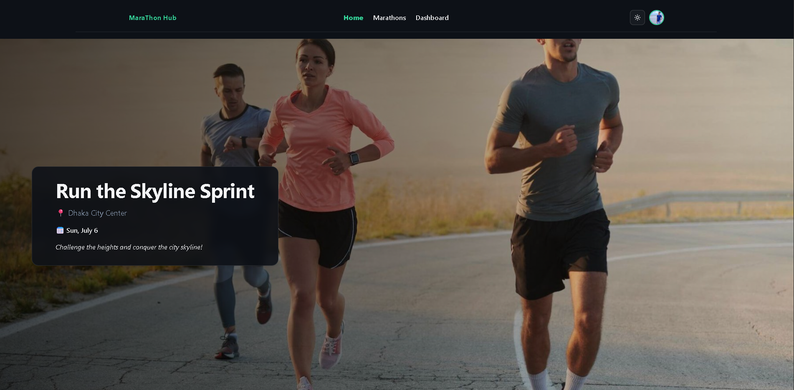 |
| FAQ |  |
| Pricing | 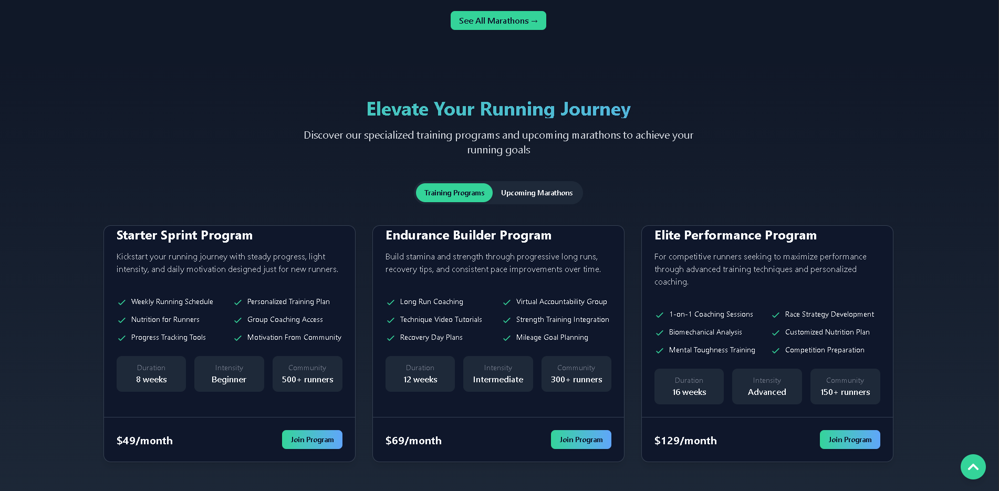 |
| Marathons | 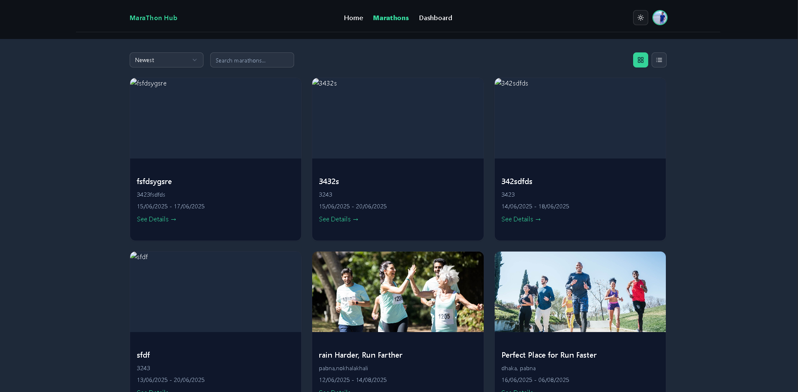 |
| Details | 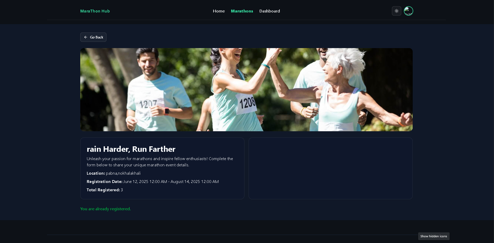 |
| Register | 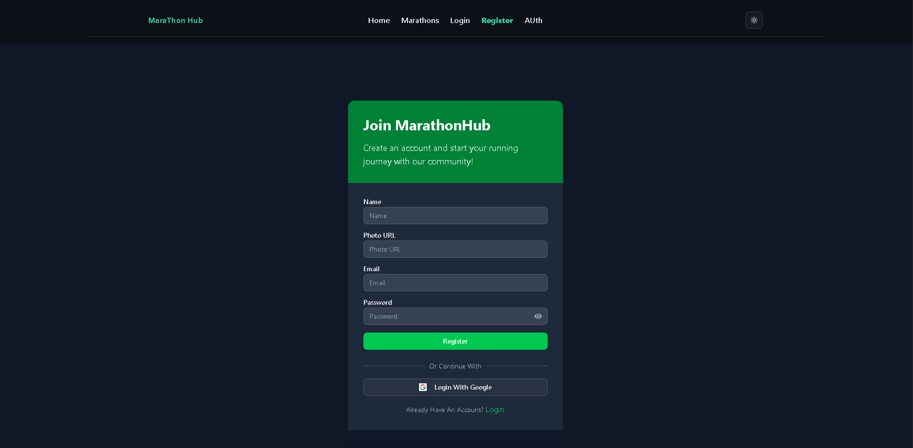 |
| Login | 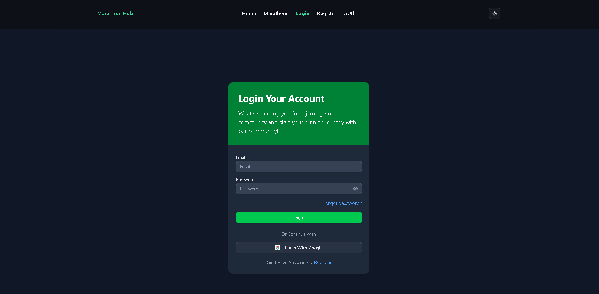 |
| Profile | 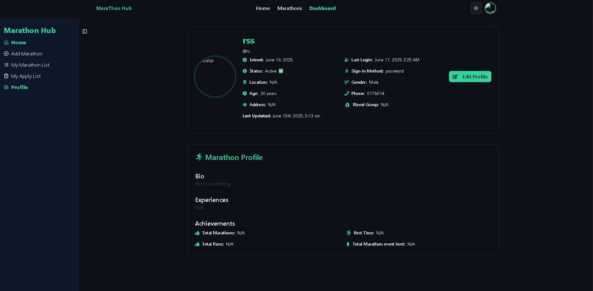 |
| My Marathons | 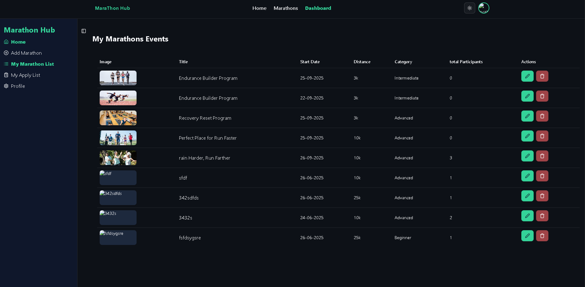 |
| Apply List | 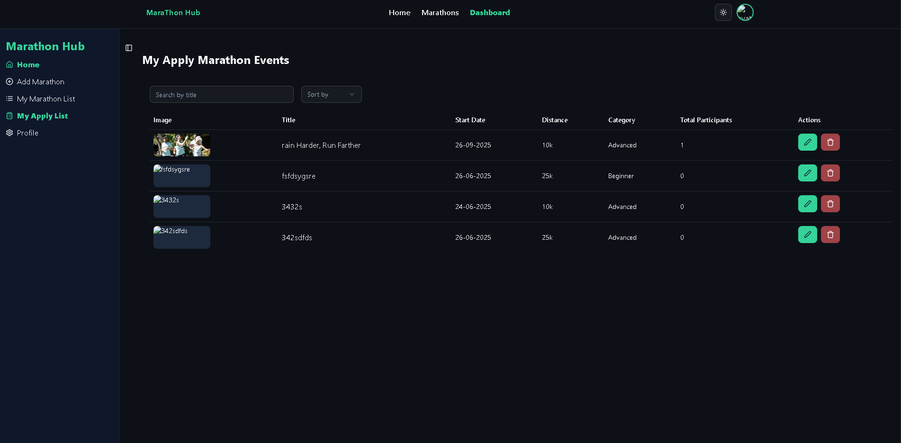 |
| Add Marathon | 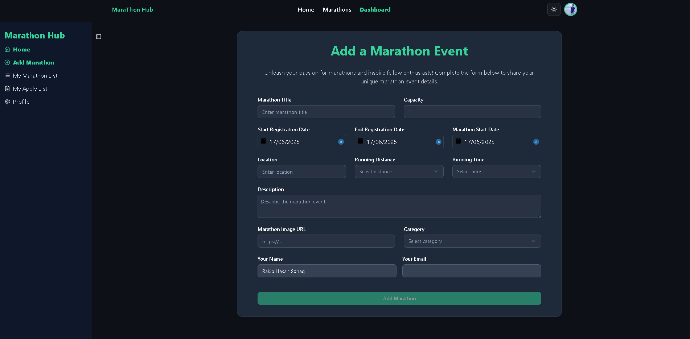 |
| Forgot Password | 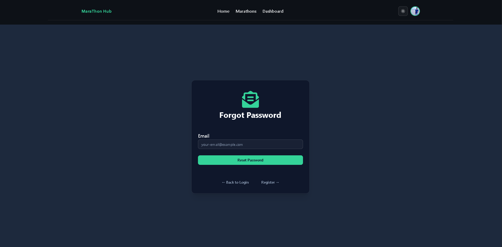 |
| 404 Page | 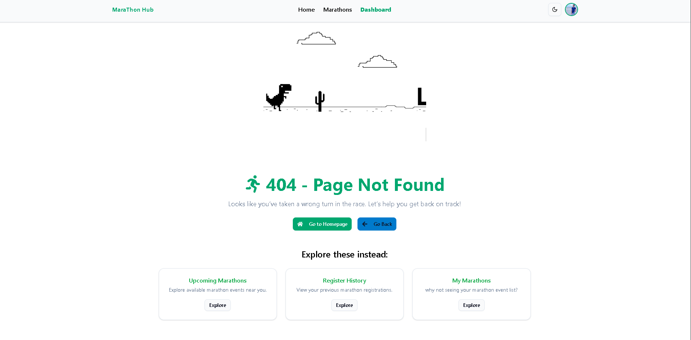 |

---

## 📦 Tech Stack

### Frontend
- React 19
- React Router 7
- Tailwind CSS 4
- ShadCN UI
- Firebase Auth
- Vite
- Swiper, Lottie, Tooltip, DatePicker, Axios

### Backend
- Node.js
- Express.js
- MongoDB
- Firebase Admin SDK
- dotenv, cors

---

## 📤 Deployment

### Frontend
- Netlify: Build command `npm run build`, folder `dist`
- Surge: `surge ./dist`

### Backend
- Vercel (recommended) or Railway
- Make sure to set `.env` variables in the dashboard

---

## 🤝 Contributing

Pull requests, suggestions, and issues are welcome! Let’s build it better together.

---

## 👨‍💻 Author

**Rakib Hasan Sohag**  
📂 [GitHub Profile](https://github.com/rakibhasansohag)

---

## 📜 License

This project is built for learning and educational purposes. All assets are for demonstration only.

---
